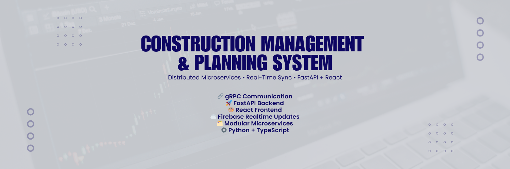

# Construction Planning & Development System

<p align="center">
  
</p>

## Installation Guide

Follow these steps to set up and run the project locally.

### Prerequisites
Ensure you have Python installed by running:
```sh
python --version
```
- Make sure you have Python version `3.10` or higher.
- Ensure you have Node.js installed for the frontend (`npm -v` to check).

### Steps to Run the Backend

1. **Navigate to the Project Directory**
   ```sh
   cd Construction-Planning-Development
   ```

2. **Enter the Main Microservice Directory**
   ```sh
   cd central-engine
   ```

3. **Create a Virtual Environment**
   ```sh
   python -m venv myenv
   ```

4. **Activate the Virtual Environment**
   - **Windows**:
     ```sh
     .\myenv\Scripts\activate
     ```
   - **Mac/Linux**:
     ```sh
     source myenv/bin/activate
     ```

5. **Install Dependencies**
   ```sh
   pip install -r requirements.txt
   ```

6. **Start the Backend Server**
   ```sh
   python main.py
   ```

---
### Steps to Run the Frontend

1. **Open a New Terminal**

2. **Navigate to the Frontend Directory**
   ```sh
   cd Construction-Planning-Development/frontend
   ```

3. **Install Dependencies**
   ```sh
   npm install
   ```

4. **Start the Frontend Server**
   ```sh
   npm run dev
   ```

5. **Open the Web Application**
   The frontend will be available at the URL provided in the terminal (usually `http://localhost:5173`).

---

### Steps to Run the Microservices

For each microservice, run the following commmands in a separate terminal: 

1. **Open a New Terminal and Enter Directories**
    ```sh
    cd qualityOfLife-ms
    cd siteSelection-ms
    cd regulatoryCompliance-ms
    ```

2. **Launch the microservices in _each_ terminal**
   ```sh
   python main.py
   ```
    - You should see ```starting server``` in the terminal if the service is launched. 


## Technologies Used

### Frontend
**React + Bootstrap + SCSS**
- The frontend is built using React and communicates with the backend via HTTP requests.
- It retrieves and updates data related to housing projects, including proximity, value, and legal considerations.

### Backend
**Main Microservice (Python + FastAPI + gRPC + REST APIs)**
- The backend microservices communicate using gRPC for efficiency.
- Exposes RESTful APIs to integrate with the frontend.
- Handles project data, stakeholder interactions, and task management.

### Database
**Firebase**
- The master microservice stores project-related data in Firebase.
- Other microservices manage their data using CSV files for lightweight storage.

---

## System Architecture

### Microservices Architecture
- Microservices interact through **gRPC**, ensuring high-performance communication.
- Each microservice handles a specific responsibility within the system.

### Client-Server Architecture
- The **React frontend** serves as a client to the **Python backend**.
- Communication is handled via **REST APIs and gRPC**, ensuring flexibility and responsiveness.

### Collaborators 
- Vaishali Jadon 
- Mansi Patel 
- Eraj Zaidi 
- Waneeha Samoon 
